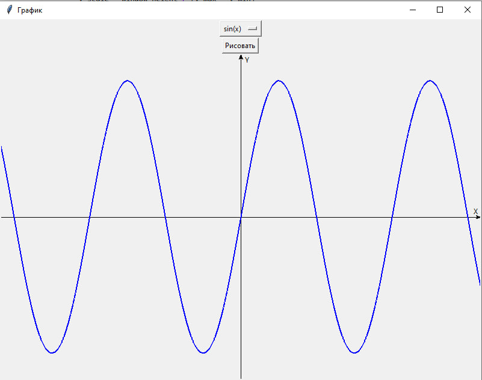

# Computer-Graphics-Labs
## Лабораторная 1

Построение графика функции.

Задаются: диапазон значений, функция, необходимо построить график с возможностью масштабирования при изменении размера окна вывода – в максимальных и минимальных точках график приближается к  верхней и нижней границам графического окна. Обязательный тест – sin(x) и x^2.
Необходимо предусмотреть выбор функций из некоторого списка. В функцию построения графика функцию передавать как параметр.
Не использовать стандартные функции построения графиков.
Язык программирования - любой (python).

  

